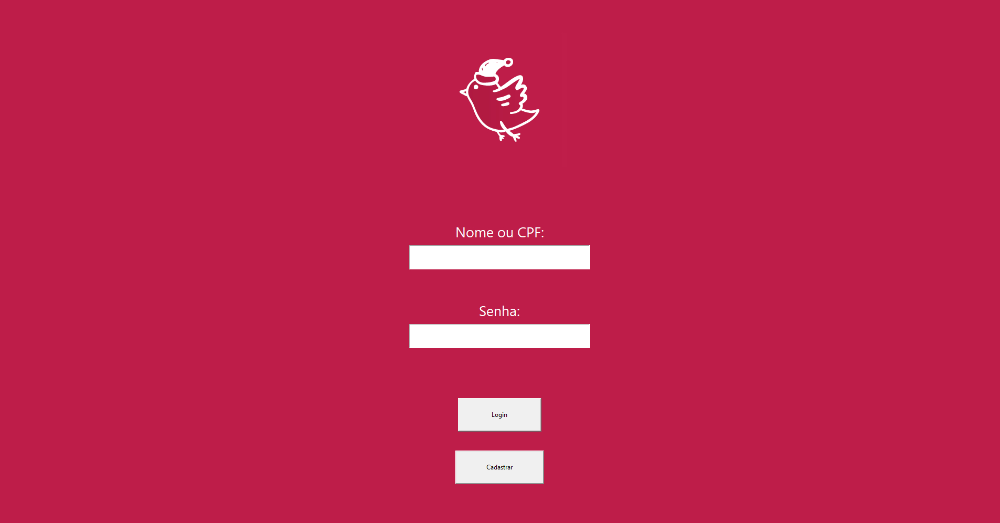
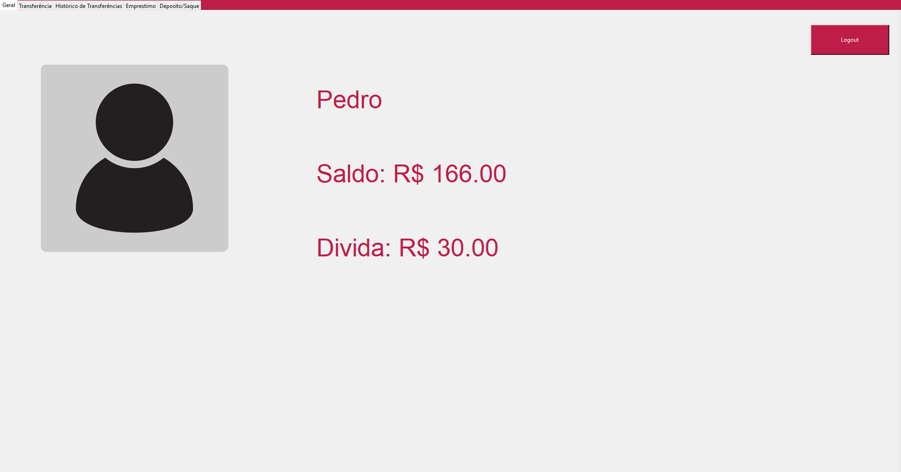
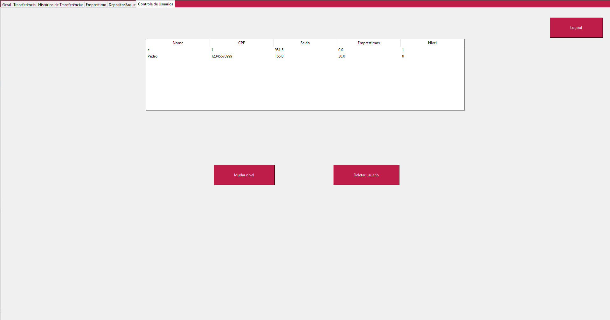

# Edubank

### Software que simula um banco, feito como projeto final para a disciplina de Programação Orientada a Objetos I.

## Como usar:

Na tela inicial o usuario pode fazer o login ou cadastrar uma nova conta. Os logins são salvos num arquivo csv.

Após logado, o usuario conta com diversas funcionalidades, como transferência, empréstimo, saque e deposito.

Os usuarios funcionarios (nivel 1) tem acesso a uma tela extra de controle de usuarios.
